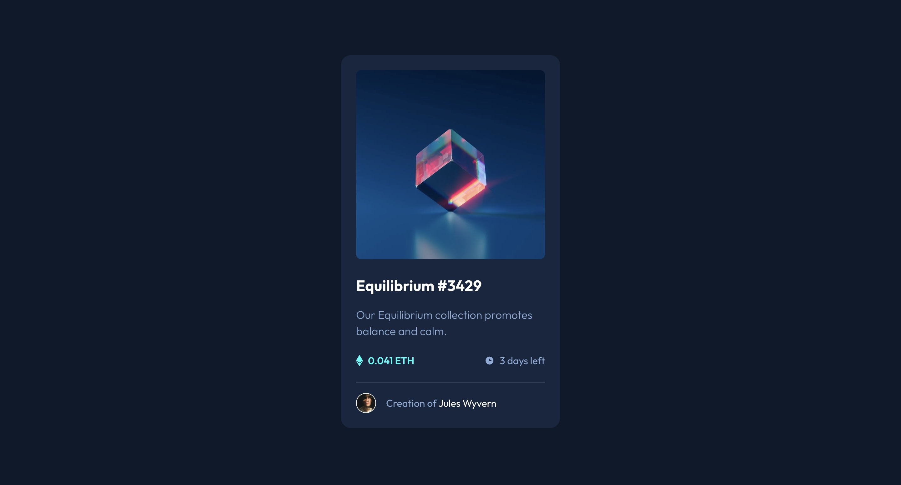

# Frontend Mentor - NFT preview card component solution

This is a solution to the [NFT preview card component challenge on Frontend Mentor](https://www.frontendmentor.io/challenges/nft-preview-card-component-SbdUL_w0U). Frontend Mentor challenges help you improve your coding skills by building realistic projects.

## Table of contents

-   [Overview](#overview)
    -   [The challenge](#the-challenge)
    -   [Screenshot](#screenshot)
    -   [Links](#links)
-   [My process](#my-process)
    -   [Built with](#built-with)
    -   [What I learned](#what-i-learned)
-   [Author](#author)

## Overview

### The challenge

Users should be able to:

-   View the optimal layout depending on their device's screen size
-   See hover states for interactive elements

### Screenshot

### Links

-   Solution URL: [https://github.com/Joshk7/nft-card](https://github.com/Joshk7/nft-card)
-   Live Site URL: [https://nft-card-plum.vercel.app/](https://nft-card-plum.vercel.app/)

## My process

### Built with

-   Semantic HTML5 markup
-   CSS custom properties
-   Flexbox
-   CSS Grid
-   Mobile-first workflow
-   Cube CSS

### What I learned

I was trying to go through this problem using CUBE CSS. First I set up the project with colors and fonts that I took from the figma file. Then, I did a CSS reset and set base styles for generic elements like body, main, and anchor tags. Then I defined a couple of COMPOSITION classes like flex and items-center. Once that was done, I defined UTILITY classes for padding and space. From there, the project looked pretty good, but I added more specific styling to places that needed it using BEM like BLOCK classes. There really weren't any great use cases for exceptions in this challenge so I didn't use them.

## Author

-   Website - [Josh Kahlbaugh](https://joshuakahlbaugh.pages.dev/)
-   Frontend Mentor - [@Joshk7](https://www.frontendmentor.io/profile/Joshk7)
